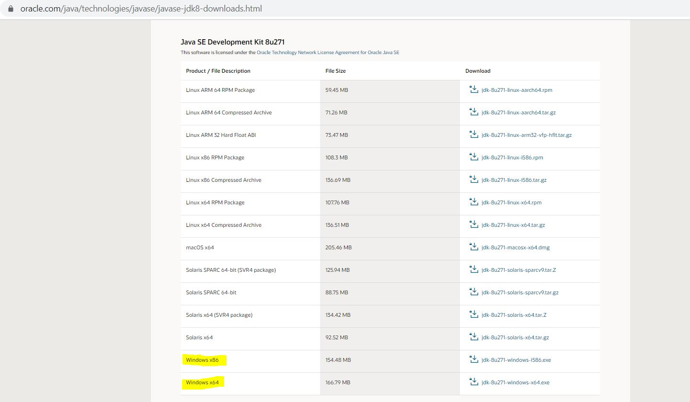
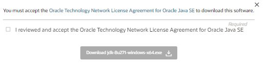
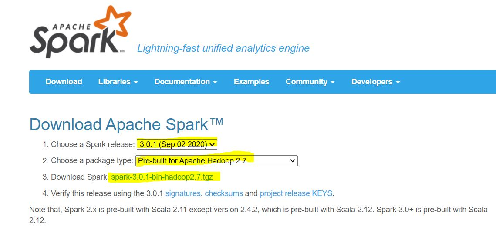
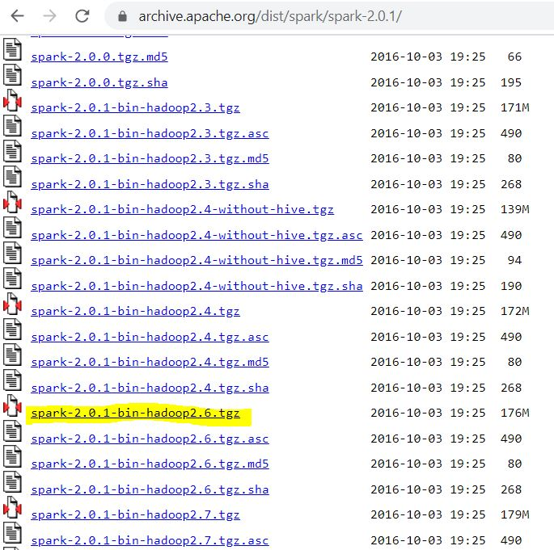
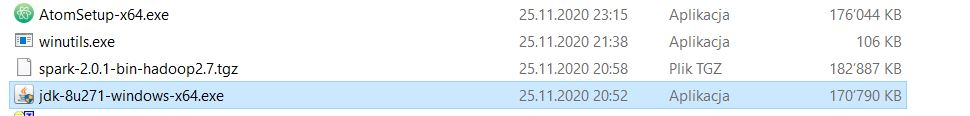
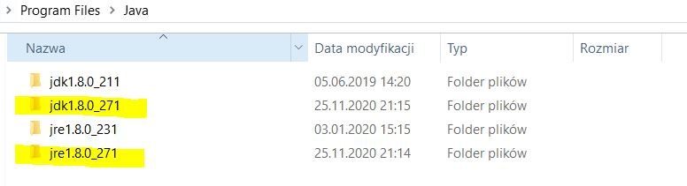

# scala-and-spark-for-big-data-and-machine-learning
Here I put my notes and codes from the course Scala and Spark for Big Data and Machine Learning on Udemy

## Setup
Below I summarized all the points to cover the local setup on Windows for Hadoop 2.7 and Spark 2.0 + Scala (should also work for newer versions) which was required.

### Step 1: Downloading JDK

Download the latest [Java Development Kit](https://www.oracle.com/java/technologies/javase/javase-jdk8-downloads.html) that matches your system (32-bit vs 64-bit). You can find the download website from Oracle here or just Googling "Java Development Kit".

When you go to the proper place to download JDK, you should see something like this (in my case I picked the proper 64-bit version for my Windows):

Before downloading you need to accept the License Agreements and register your account:

### Step 2: Downloading Hadoop & Spark

Go to (apache.spark.org)[http://spark.apache.org/downloads.html] and download a pre-built version of Spark.

In my case it was a bit older version than the current one (pre-built for Hadoop 2.7 and Later) and preferably Spark 2.0 or later. Therefore I had to find it in previous releases:

- Go: https://archive.apache.org/dist/spark/
- Pick proper version you want to install. In my case it was the highlighted one:

### Step 3: Installation of JDK

Go to the place where you downloaded Java Development Kit (in my case it is in _Downloads_).

Click and install. I followed the default settings and in my case everything was installed in _C:\Program Files\Java_ but is important to remember the path, as we will use this later. 

### Step 4: Installing Hadoop

### Step 5: Placing _winutils.exe_

### Step 6: Setting PATH and enviromental variables

### Step 7: Testing
